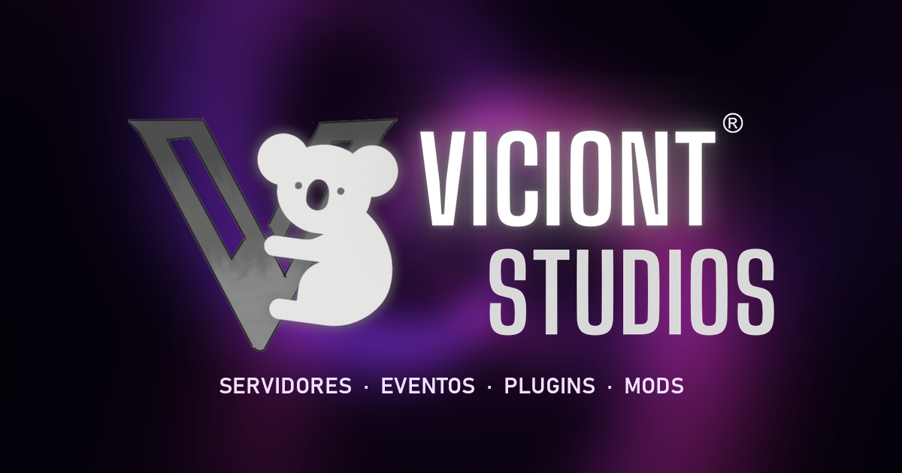

<p align="center">
  <a href="https://crissyjuanxd.github.io/Viciont-Studios-Portafolio/">
    
  </a>
</p>

<h1 align="center">Viciont Studios · Portafolio</h1>

<p align="center">
  <b>Servidores SMP, hardcores, eventos, plugins y mods de Minecraft.</b><br>
  Estudio creado por <a href="https://github.com/CrissyjuanxD">CrissyjuanxD</a>.
</p>

<p align="center">
  🌐 <a href="https://crissyjuanxd.github.io/Viciont-Studios-Portafolio/"><b>crissyjuanxd.github.io/Viciont-Studios-Portafolio</b></a>
</p>

---

## Sobre el estudio

**Viciont Studios** es un estudio dedicado a la creación de servidores de Minecraft (SMP, hardcores, eventos…) y a la distribución de plugins y mods, públicos o privados. Es un estudio en crecimiento que busca que los jugadores tengan mejores experiencias en sus servidores, de una manera sencilla e increíble.

Algunos de nuestros proyectos: **Viciont Hardcore 3**, **IsManuSMP**, **OneBlock With Manu and George**, **Croissants**, **Hide And Seek**, **Hunger Games**, **Viciont Hardcore 2** y **Viciont SMP 2**.

## La web

| Sección | Qué hay |
| --- | --- |
| **Sobre nosotros** (inicio) | Presentación del estudio, accesos directos a cada sección y los **Miembros del Team** (al pulsar un miembro se abren sus redes). |
| **Proyectos** | Los servidores y eventos que hemos hecho. |
| **Plugins** | Plugins públicos, como *Viciont Protections* y *Viciont Guis Plugin*. |
| **Mods** | Mods públicos, como *Viciont Guis*. |
| **Contáctanos** | Correo del estudio, rango de precios y un formulario que prepara el correo por ti. |

**Características**

- 🌀 Fondo animado en **WebGL**: una espiral difuminada morada y rosa que gira en círculos (con alternativa en CSS si el navegador no soporta WebGL).
- ⚡ Efectos **electrónicos y glitch**: títulos con separación RGB, texto que se descifra, efecto de escritura en terminal, transiciones con interferencias y líneas de escaneo.
- 📱 **Responsive** para móviles, tablets y PC.
- 🔗 Tarjetas con **confirmación de enlaces**: antes de salir de la web se muestra a dónde lleva el enlace y se pregunta si quieres ir.
- 🛠️ **Panel de administración** para cambiar textos, imágenes, miembros y tarjetas sin tocar código.
- ♿ Accesible: navegación con teclado, ventanas con foco controlado y respeto a “reducir movimiento”.

## Panel de administración

Todo el contenido de la web vive en [`data/content.json`](data/content.json) y se edita desde el panel, en **`/admin/`**.

- **Acceso seguro:** se entra con un *token de acceso de GitHub* con permiso de escritura en este repositorio. Sin ese token nadie puede cambiar nada: la web es estática y GitHub es quien autoriza cada cambio.
- **Borrador + vista previa en vivo:** los cambios se guardan como borrador en tu navegador y puedes verlos en la web en tiempo real antes de publicarlos.
- **Publicar:** crea un commit en este repositorio (con las imágenes optimizadas en `assets/uploads/`) y GitHub Pages actualiza la web en 1-2 minutos. Las páginas abiertas se actualizan solas.
- **Historial:** cada publicación queda guardada; desde el panel puedes volver a cualquier versión anterior.

## Estructura

```
├── index.html            Web pública
├── admin/index.html      Panel de administración
├── 404.html              Página de error
├── data/content.json     Todo el contenido editable
└── assets/
    ├── css/              base.css · site.css · admin.css
    ├── js/               app.js (web) · admin.js (panel) · background.js (espiral WebGL)
    │                     fx.js (efectos) · core.js · ui.js · github.js · config.js
    ├── img/              Logo, iconos e imagen para redes
    └── uploads/          Imágenes subidas desde el panel
```

Sin dependencias ni proceso de compilación: HTML, CSS y JavaScript (módulos ES).

## Probar en local

```bash
python -m http.server 8000
```

Luego abre <http://localhost:8000>.

---

<p align="center">
  Diseñado y desarrollado por <a href="https://github.com/CrissyjuanxD"><b>CrissyjuanxD</b></a> · © Viciont Studios<br>
  <sub>Viciont Studios no está afiliado a Mojang Studios ni a Microsoft. Minecraft es una marca de Mojang Studios.</sub>
</p>
